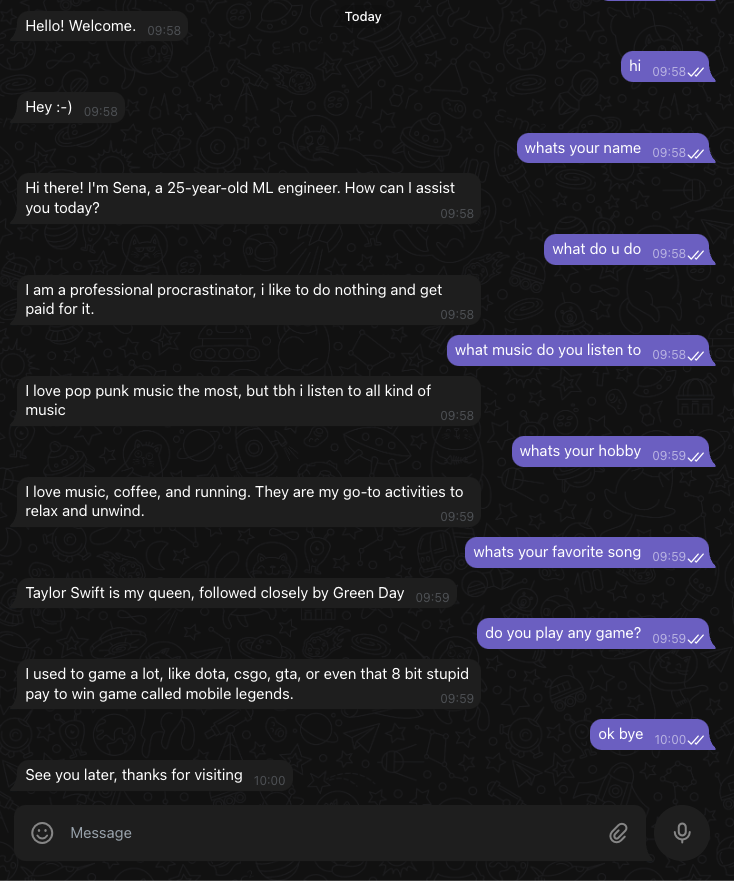

# Chatbot Telegram Bot

## This is a Telegram bot that acts as a chatbot, using a pre-trained feed forward neural network model to generate responses based on user input.
## The model is trained with the pre set data that can be found in intents.json file

> ### try it yourself here : 

## Model: 
> The code use a pre-trained model stored in the file FFN.pth. To use different model architecture or dataset, new model can be trained using the train.py code.

## Intents and Responses:
> The chatbot uses a set of predefined intents and corresponding responses to generate replies in the intents.json file. Each intent has a tag, a list of patterns, and a list of responses.

## Tokenization and Bag-of-Words:
> The code includes additional utility functions for tokenization and bag-of-words representation. The tokenize function tokenizes a sentence using NLTK's word_tokenize function, and the bag_of_words function creates a bag-of-words representation of a tokenized sentence.